# earnings-edge

**Quantified earnings playbooks for the Nifty 500.** Given a stock, surface historical earnings behavior, institutional positioning, and prior similar setups — so you know the base rate before results, not after.

Live demo → **[earnings-edge-omega.vercel.app](https://earnings-edge-omega.vercel.app)**
API → [`/health`](https://honest-caring-production-e1b8.up.railway.app/health) · [`/api/v1/stocks/RELIANCE`](https://honest-caring-production-e1b8.up.railway.app/api/v1/stocks/RELIANCE)

> Not a prediction tool. Base rates + positioning + pattern match. Educational / research use only.

---

## Highlights

Built solo, end-to-end: data pipeline → database → API → web app, live and self-updating.

- **Answers one question for each of India's 500 largest listed companies** — *when this company reports results, what has its share price usually done?* — computed from 12 years of market history: **1M+ price records** and **5,800+ earnings events**.
- **Automated the entire data supply chain.** Seven scrapers pull prices, large block trades and institutional flows from NSE/BSE every weekday night, built **fail-soft** with per-request timeouts and retries so one unreliable exchange endpoint can't stall the run.
- **Recovered earnings dates the data source never published** by detecting each announcement's own price-and-volume spike signature — making **458 of 500 stocks (92%)** analysable instead of leaving them blank.
- **Stress-tested its own output and caught it lying:** unadjusted stock splits were producing fake ±50% earnings reactions. Traced the root cause, **backfilled corrected prices across 836,000 rows**, and re-verified every affected stock.
- **Similarity engine surfaces a stock's most comparable past quarters** (cosine similarity on z-standardised earnings features) — then diagnosed its own blind spot, where same-quarter analogues scored near zero, and fixed it with cyclical encoding.
- **Readable by a first-time investor, not just an analyst** — plain-English verdicts (*"usually rises after results: 10 of 13"*), a definition on every jargon term, and a deliberate refusal to dress historical base rates up as predictions.

---

## What it does

For any Nifty 500 stock, the app answers four questions:

| Panel | Question it answers |
|---|---|
| **Historical Earnings** | How has this stock reacted after its own past prints? (gap %, day-1/3/5 returns, volume spike, YoY/QoQ growth) |
| **Base Rates** | Empirical distribution of past reactions — median, tails, hit rate above 0. Not a forecast, a prior. |
| **Positioning** | Recent 30-day net bulk/block deals for this stock + market-wide FII/DII flow + delivery-% trend. Where is smart money leaning heading in? |
| **Pattern Match** | Cosine similarity on z-score standardized features (growth, drift, delivery, positioning) against the stock's own prior earnings — with what happened next. |

Plus a **cross-universe screener** (filter 500 stocks by YoY growth / drift / days-since-announcement / delivery-%) and a **home dashboard** (upcoming earnings, notable deals, 30-day FII/DII bar chart).

---

## Architecture

```mermaid
flowchart LR
    subgraph Sources
        NSE[NSE bhavcopy, deals, FII/DII, option chain]
        BSE[BSE deals]
        SCR[Screener.in quarterly financials]
    end
    subgraph Ingest["Nightly ingest (GitHub Actions cron, 15:30 UTC)"]
        UNI[nse_universe]
        PRC[nse_prices]
        DEA[nse_deals]
        FII[nse_fii_dii]
        DEL[nse_delivery]
        OPT[nse_options]
        EAR[screener_earnings]
        CMP[compute_reactions + iv_rank]
    end
    DB[(Neon Postgres<br/>~1M price rows<br/>5.8k earnings events<br/>5.6k reactions)]
    API[FastAPI on Railway<br/>/api/v1/*]
    UI[Next.js 14 on Vercel]

    Sources --> Ingest --> DB
    DB --> API --> UI
```



- **Data pipeline is fail-soft** — every source is wrapped in `track_run()` and one broken endpoint doesn't kill the batch.
- **Announcement dates are inferred** from a price + volume + gap signature when Screener doesn't publish them, then reactions are computed from the inferred date.
- **CORS is env-driven** with a `*.vercel.app` regex so preview deploys work without a code change.

---

## Tech stack

| Layer | Choice | Why |
|---|---|---|
| Backend | Python 3.11, FastAPI, SQLAlchemy 2, Alembic | Typed I/O, migration discipline |
| DB | Neon Postgres (Singapore) | Serverless, free tier survives ~1M rows and Mac-off ingests |
| Ingest HTTP | httpx + tenacity + disk cache + SIGALRM per-request timeout | NSE rate-limits and hangs; one stuck request must never wedge the batch |
| Frontend | Next.js 14 (app router), TypeScript, Tailwind, Recharts | Server components for the stock playbook (single request), client component for the URL-synced screener |
| Deploy | Railway (backend, Railpack), Vercel (frontend), GitHub Actions (nightly cron) | Free tiers, zero-ops |
| Analytics | pandas + numpy for reactions, IV rank, and pattern match; z-score cosine for similarity | Kept the dependency count boring |

---

## Repo layout

```
backend/
  app/
    routers/    stocks, earnings, positioning, patterns, screener, home, market
    services/   base_rates, positioning, pattern_match, screener, home
    models/     SQLAlchemy tables (10 total, 4 migrations)
  ingest/
    sources/    per-source scrapers, all fail-soft
    run_nightly.py    orchestrator
  Procfile, runtime.txt, requirements.txt    Railway deploy config
frontend/
  src/app/            Next.js routes: /, /stock/[symbol], /screener
  src/components/     panels + shared UI
  src/lib/            typed API client
notebooks/
  06_case_study.ipynb    two worked earnings events (TCS Q1FY27 + PCBL Q4FY26) — history, base rates, positioning, pattern match, verdict
.github/workflows/nightly-ingest.yml    cron 15:30 UTC Mon-Fri
```

---

## Local dev

```bash
git clone https://github.com/Char1an/earnings-edge && cd earnings-edge
cp .env.example .env   # fill DATABASE_URL (Neon or local Postgres via docker-compose)

make install           # creates backend/.venv, installs deps
make migrate           # alembic upgrade head
make api               # uvicorn on :8000

# in another terminal
make frontend-install
make frontend          # next dev on :3000
```

Data ingestion (one-shot; the nightly cron runs these automatically once deployed):

```bash
. backend/.venv/bin/activate
python -m ingest.sources.nse_universe            # ~500 stocks, 1 min
python -m ingest.sources.nse_prices --mode backfill --years 10 --skip-populated
python -m ingest.sources.screener_earnings --skip-populated
python -m ingest.sources.compute_reactions
```

---

## Data state (production)

| Table | Rows | Coverage |
|---|---|---|
| `stocks` | 500 | Full Nifty 500, sector + F&O flag populated |
| `prices` | ~1,003,000 | ~12 years OHLCV, ~2,500 sessions per stock |
| `earnings_events` | 5,824 | 463/500 stocks; 37 not mappable to Screener under NSE symbol |
| `earnings_reactions` | 5,591 | 458/500 stocks (91.6%) with computed day-1/3/5 reactions |
| `iv_rank` | growing | Needs ≥20 nightly snapshots to be meaningful |

---

## Deploy

Fully deployed on free tiers. See [HANDOFF.md](HANDOFF.md) §9 for the wiring — Railway env vars, Vercel env, CORS regex, redeploy commands.

- Backend: `RAILWAY_API_TOKEN=... railway up --detach` from `backend/`
- Frontend: `vercel deploy --prod --yes` from `frontend/`
- Cron: `.github/workflows/nightly-ingest.yml` runs the orchestrator against Neon nightly at 15:30 UTC Mon–Fri

---

## Known limitations

- ~~Prices are not split/bonus-adjusted.~~ **Fixed.** `prices.adj_close` is backfilled from yfinance (836k rows updated) and `compute_reactions` / timelines endpoint / `pattern_match._drift_20d` use it via COALESCE with raw close as fallback. Reaction max magnitudes for COCHINSHIP, INFY, WIPRO, TITAN, RELIANCE all now sit in the realistic 8-24% range.
- **Screener match rate: 463/500.** 37 stocks have names that don't cleanly map to NSE symbols on Screener. Per-symbol slug mapping would fix it.
- **FII/DII flows are market-wide, not per-stock.** No free per-stock institutional flow data exists on Indian markets.
- **Options history starts from first nightly cron run.** IV rank is only meaningful after ~20 sessions of snapshots.

---

## Roadmap

- Shareholding-pattern quarterly ingest (per-stock FII/DII, better than market-wide)
- Watchlist on the home page (localStorage)
- Symbol-mapping table for the 37 missing Screener stocks

Full backlog in [HANDOFF.md](HANDOFF.md) §10.

---

## Disclaimer

Educational / research project. Not investment advice. No SEBI RA registration. Historical base rates are not forecasts.
